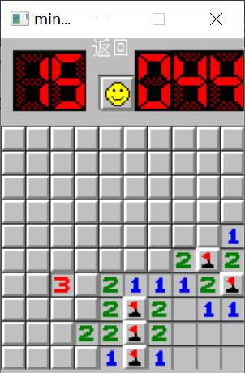

# mine_clearance
基于Easyx图形库的C/C++窗口应用扫雷游戏

# **1.**  需求分析

扫雷是一种常见的益智游戏，可以在计算机上实现。以下介绍用C/C++语言和EasyX图形库编写扫雷游戏的需求分析。

## 1.1 **游戏概述**

扫雷游戏是一种单人游戏，目标是在一个由方块组成的网格中，找到所有不含地雷的方块，同时避免触雷。玩家需要揭开方块，并使用数字提示来确定周围的地雷数量。如果揭开的方块是地雷，则游戏结束。

## 1.2 **游戏功能需求**

界面设计：游戏需要有一个美观的界面，包括游戏区域、计时器、雷区标记数等。

游戏难度设置：玩家可以在开始游戏前选择游戏难度，包括初级、中级和高级。不同的难度级别应该具有不同的雷数和游戏区域大小。

雷区生成：游戏开始后，需要随机生成雷区，确保雷数和位置是随机的。

揭开方块：玩家可以左键单击方块来揭开它。如果方块上有数字，则显示数字；如果方块上没有数字，则继续揭开周围的方块。

标记雷区：玩家可以右键单击方块来标记雷区。标记后的方块不能被揭开，以便玩家知道哪些方块可能是地雷。

游戏结束判断：当玩家揭开所有不含地雷的方块时，游戏获胜。当玩家揭开地雷方块时，游戏失败。

计时器：游戏需要计时器来记录玩家完成游戏所用的时间。

## **1.3** 技术需求

C/C++语言：游戏需要使用C/C++语言来实现。

EasyX图形库：EasyX是一个简单易用的图形库，可以在Windows平台上使用。它提供了一些基本的绘图函数和图像处理函数，非常适合用于实现游戏界面。

随机数生成：需要使用随机数生成函数来生成雷区和难度级别。

鼠标事件处理：需要处理鼠标左键和右键的单击事件，来实现方块的揭开和标记。

计时器实现：需要使用计时器来实现计时功能，并将结果显示在游戏界面上。

# **2.**  功能描述

## **2.1** 游戏界面设计

游戏界面是扫雷游戏的重要组成部分，需要包括游戏区域、计时器、雷区标记数等。在设计游戏界面时，需要考虑用户友好性和美观性。游戏区域应该是一个正方形，并且可以根据游戏难度调整大小。计时器和雷区标记数应该在游戏界面的顶部或底部显示。

## **2.2** 游戏难度设置

游戏难度设置是扫雷游戏中的一个重要功能，应该包括初级、中级和高级三个难度级别。不同的难度级别应该具有不同的雷数和游戏区域大小。例如，在初级难度下，游戏区域可以是9x9的大小，雷数可以是10个；在中级难度下，游戏区域可以是16x16的大小，雷数可以是40个；在高级难度下，游戏区域可以是16x30的大小，雷数可以是99个。

## **2.3** 雷区生成

在游戏开始后，需要随机生成雷区，确保雷数和位置是随机的。生成雷区的算法应该是高效的，并且需要保证生成的雷区没有重复的位置。为了保证游戏的公平性和挑战性，生成雷区时应该遵循一定的规则，例如避免将雷区集中在一个区域内。

## **2.4** 揭开方块和标记雷区

在游戏中，玩家可以使用左键单击方块来揭开它。如果方块上有数字，则显示数字；如果方块上没有数字，则继续揭开周围的方块。玩家可以使用右键单击方块来标记雷区。标记后的方块不能被揭开，以便玩家知道哪些方块可能是地雷。

## **2.5** 游戏结束判断

当玩家揭开所有不含地雷的方块时，游戏获胜。当玩家揭开地雷方块时，游戏失败。游戏结束后应该弹出提示框，显示游戏结果和玩家的用时。

## **2.6** 计时器

游戏需要计时器来记录玩家完成游戏所用的时间。计时器应该在游戏界面的顶部或底部显示，并且应该在玩家开始游戏后立即开始计时。

## **2.7** 其他功能

除了以上所述的基本功能，扫雷游戏还可以添加一些更加细致和实用的功能，以提高游戏的趣味性和用户体验。以下是一些可能有用的附加功能：

-  重新开始：玩家可以在游戏过程中重新开始游戏，这样可以减少重复操作，提高游戏效率。

- 暂停/恢复：在游戏过程中，玩家可能需要暂停游戏，比如接听电话或者离开一会儿。因此，游戏应该提供暂停和恢复功能，以便玩家可以在需要的时候暂停游戏，再次进入游戏时恢复到之前的状态。

# **3.**  功能实现

## **3.1** 游戏界面实现

首先，在屏幕上显示一个"返回"的文字。然后，在游戏区域中心显示一个笑脸的图片，代表游戏状态。接下来，在左上角和右上角分别显示雷数和计时器。雷数代表游戏中还未揭开的地雷数量，计时器用于记录玩家完成游戏所用的时间。图片的显示使用了EasyX图形库中的putimage函数。

接下来是一个双重循环，用于绘制扫雷游戏区域中的方块。循环中使用了判断语句，根据map数组中的值来选择不同的图片。如果map[i][j]的值在19到28之间，表示这个方块还没有被揭开，那么就显示一个方块的图片；如果map[i][j]的值在-1到8之间，表示这个方块已经被揭开，那么根据数字的大小选择不同的数字图片。如果map[i][j]的值在39到48之间，表示这个方块被标记为雷区，那么就显示一个标记为镖旗的图片；如果map[i][j]的值为-100，表示这个方块是地雷，那么就把这个方块的图片改成一个红色的地雷图片。

代码主要是实现扫雷游戏图像的显示，通过循环和判断语句来选择不同的图片，使得游戏的图像能够随着游戏进程的变化而改变，从而增强了游戏的交互性和可玩性。

## **3.2** 难度选择实现

函数名为"whitchtouch2"。函数的作用是根据用户在屏幕上的鼠标点击来选择游戏难度，即根据用户点击的区域改变游戏所需的参数。

函数内部使用了"GetMouseMsg"函数来获取用户的鼠标输入，并通过"msg.uMsg"获取鼠标消息的类型。如果鼠标消息是"WM_LBUTTONDOWN"，则进入分支语句。

分支语句中，通过判断用户点击的区域的坐标（x和y）来确定游戏难度。如果用户点击的是第一个区域（坐标范围为(80,50)到(250,120)），则将游戏难度设为简单模式，同时清空绘图设备；如果用户点击的是第二个区域，则将游戏难度设为中等模式，同时清空绘图设备；如果用户点击的是第三个区域，则将游戏难度设为困难模式，同时清空绘图设备。其中，变量"hight"、"width"、"grahight"、"grawidth"、"bomb" 分别代表游戏地图高度、宽度、窗口高度、窗口宽度、地雷数量。

函数whitchtouth接收鼠标消息，当鼠标左键按下时，根据鼠标的位置来确定用户选择的游戏难度。如果鼠标在(80, 50)到(250, 120)的矩形范围内，将ture设置为0；如果鼠标在(80, 150)到(250, 220)的矩形范围内，则将ture和choice都设置为0。

函数showbomb遍历整个雷区map，将所有值为19的格子的值减去20。在这个程序中，如果map[i][j]的值为19，则表示这个格子是一个炸弹并且被标记为炸弹。为了在显示雷区时正确地显示这个格子，需要将它的值减去20。

整个函数的作用是用于用户选择游戏难度时的操作。

## **3.3** 用户动作和游戏状态捕抓实现

当鼠标有输入时，playgame()函数被调用。该函数通过调用MouseHit()函数来检查是否有鼠标输入。如果没有，则跳过这个函数以避免影响游戏时间的计算。如果有鼠标输入，则调用GetMouseMsg()函数获取鼠标的消息。接着，该函数根据msg.uMsg来执行相应的操作，主要有以下几个：

- 鼠标左键按下并移动时：如果游戏正在进行中并且用户没有输赢，那么该函数会根据鼠标的坐标来判断用户是否点击了游戏区域中的格子。如果点击了，就会执行相应的操作，例如展开格子或标记旗子。如果点击到了炸弹，游戏失败，执行展示所有炸弹并停止游戏的操作。另外，如果这是第一次点击，则会记录开始时间。

- 鼠标左键松开时：如果游戏正在进行中并且用户没有赢得游戏，那么将笑脸变回正常状态。

- 鼠标右键按下时：如果游戏正在进行中并且用户点击了游戏区域中的格子，则可以标记该格子为旗子。如果该格子已经被标记为旗子，则可以取消旗子标记。

总的来说，该函数实现了基本的扫雷游戏功能，包括展开格子、标记旗子等。同时，也考虑了一些特殊情况，例如游戏失败时展示所有炸弹、最后一个展开的格子是炸弹时不算胜利等。

## **3.4** 玩法功能实现

函数openzero实现的是打开一个没有地雷的区域，如果这个区域没有地雷，那么将其打开并标记为已翻开（在原来的数字基础上减去20），然后递归调用openzero函数，打开周围的8个区域，直到所有相邻的没有地雷的区域都被打开为止。

函数newgame实现的是开始新游戏，将整个游戏区域的格子状态全部置为0，然后调用updategame函数更新游戏状态，即重新绘制游戏画面。

# **4.**  界面图示

## **4.1** 主页面

## **4.2** 难度设置

### 4.2.1 初级

### 4.2.2 中级

### 4.2.3 高级

## 4.3 踩雷

## 4.4 标记

# 5. 环境

Windows10/11，Visual Studio 2022

# 5. 运行

Visual Studio 2022选择**打开项目或解决方案（P）：打开本地 Visual Studio 项目或 sln 文件**，选择代码中的sln文件，运行即可，如果包的环境问题，自己搜一下很好解决。
